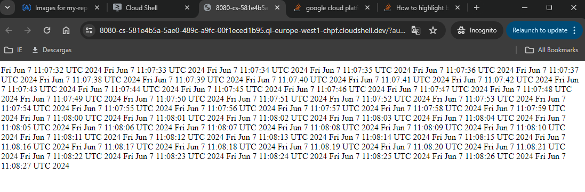

# Development of Cloud Native Apps

This is the repo for the different files and LABs developed for the class "Cloud Native Development" imparted by Javier Cañadillas.

## LAB1: Intro to Kubernetes
We created a K8s cluster with 3 nodes with HA in a region. Here we tested different things like setting up a GKE cluster, creating pods, deployments and services, as well as deployment patterns like blue-green.

### 1. Create K8s cluster:
Created with gcloud command:
```bash
gcloud container clusters create my-cluster --num-nodes=3 --region=europe-west1
```

### 2. Creating a Pod:
2.1. First create a repo for my image:
```bash
gcloud artifacts repositories create my-repo --repository-format=docker --location=europe-west1
```

2.2. Push the image to the registry:
```bash
gcloud builds submit -t europe-west1-docker.pkg.dev/$PROJECT_ID/my-repo/hello .
```

Create the pod manifest with:
```bash
envsubst < hello-pod.yaml.template > hello-pod.yaml
```
It substitutes the actual project ID for the variable "PROJECT_ID" in the manifest template.

2.3. Now we're ready to apply:
```bash
kubectl apply -f hello-pod.yaml
```
Access the pod:
```bash
kubectl port-forward hello-pod 8080:8080
```

### 3. Containers vs Pods:
In this part we created a pod with 2 containers (1st and 2nd).
This is the summary of the explanation provided by Gemini:
```text
This manifest creates a Pod with two containers. The first container serves the content from the html volume, which is initially empty. The second container continuously updates a file in the html volume with the current date and time. This setup allows you to observe the changes in the file served by the first container.
```
Nice summary

In this exercise we also applied the pod in a different "test" namespace.

Here's a screenshot of the dates (2nd) container in action:
